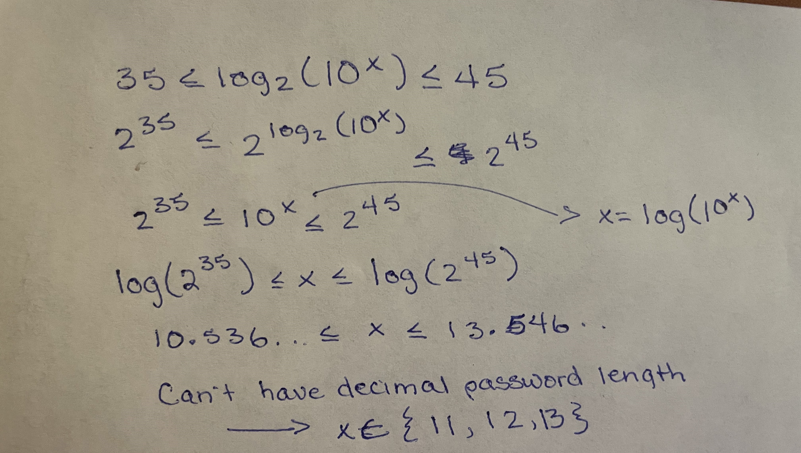
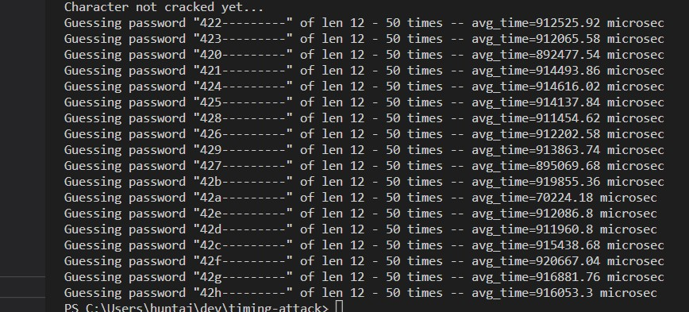

# Code Security Homework Assignment: Timing Attack
## Assignment Description
In this assignment, you are tasked with thinking like an attacker. To that end, you’ve come to understand there is a web service that is vulnerable to a timing attack. This implementation is particularly obvious and should be relatively easy to break.
Assume that through other means, you have learned three vital pieces of information to assist in gaining access to the system.
1. The alphabet of possible characters is only 0 through 9. Thus a password may be “1234” or “543224” or any other combination of these digits.
2. The entropy of the password is somewhere between 35 and 45 bits. Using what you know about entropy, determining a reasonable range of password lengths is possible.
3. The format of the message is a POST with a “pwd” parameter.
   1. A cURL command to do this would look something like this: `curl -X POST https://qrxjmztf2h.execute-api.us-west-2.amazonaws.com/prod -d '{"pwd":"1111"}' -v`
   2. If the body is in the wrong format we’ll get a 422 returned
   3. If the pwd is wrong, we’ll get a 401
   4. If the pwd is right, we’ll get a 200
4. A test endpoint that behaves exactly the same way as the puzzle can be found at [https://qrxjmztf2h.execute-api.us-west-2.amazonaws.com/prod/example](https://qrxjmztf2h.execute-api.us-west-2.amazonaws.com/prod/example) with a correct password of “42answersall”
   1. Consider using this to test good/bad letters to see the response time
   2. Consider running many tests per letter (in my solution, I used a threadpool to make ~10 requests simultaneously to gather timing information)
   3. Test URL: `curl -X POST https://qrxjmztf2h.execute-api.us-west-2.amazonaws.com/prod/example -d '{"pwd": "42answersall"}' -v`
   
### Recommendations
1. You might sketch out your approach knowing what you do about timing attacks prior to attacking the system.
2. You might consider gathering some metrics about what time differences look like assuming good and bad responses.
3. You might consider trying to determine the key length first.
ASSIGNMENT HOST: https://qrxjmztf2h.execute-api.us-west-2.amazonaws.com/prod
DEMO: https://qrxjmztf2h.execute-api.us-west-2.amazonaws.com/prod/example

## My Approach
At the highest level, here's what we know about how the password is verified on the server: it's checked linearly, character by character. Meaning that the server will take a guessed password `G` as input, and compare it character by character with the real password `R` until it reaches the end of either *or* it reaches a mismatch. Each character comparison takes time, which means a longer response time for one guess G1 than for another guess G2 implies that a longer first substring of G1 is correct than G2. 

### Obtaining Password Length Bounds from Entropy Requirements
As for the password length: the given entropy is $35 \leq (H(X) = \log_2(N)) \leq 45$. Our alphabet length, i.e. our total number of symbols, is 10, so $N = 10^x$ where x gives the bounds for our password length (the number of samples). That is, $35 \leq (H(X) = \log_2(10^x)) \leq 45$. Below is my handwritten solution for finding `x`: 

So, x is either 11, 12, or 13 characters long, which means that in total, we have 
$10^11 + 10^12 + 10^13$ possible passwords.  

### Confusing Results
Interesting phenomenon... even though 42a is the correct first substring on the demo host, 42a produces the smallest response time among all other first 3-char substring guesses.

Because of this, I added a more general check - instead of simply looking for a signficantly higher response time per character position to crack new characters, I began looking for a signficantly *different* response time. I used the numpy-based outlier rejection function proposed [here](https://stackoverflow.com/questions/62802061/python-find-outliers-inside-a-list) but adjusted it to extract outliers rather than reject them. After a bit of tuning on the m argument, I got the expected behavior using the demo host. 

I also tried to leverage multiprocessing and multithreading using the [concurrent.futures](https://docs.python.org/3/library/concurrent.futures.html) layer but that was causing my time measurements to be highly wonky, so I ended up simplifying things back down and removing most of the multiprocessing/multithreading logic. Even with the basic multithreading in the `guess_password_repeated` function, I couldn't get expected behavior if the max_workers value was greater than 4. 

### Polishing the Automation

In short, the main tunable parameters I had to focus on were the number of concurrent workers, the threshold for outlier extraction, the number of times to repeat a request for a given password, and whether to use total time or average time (total worked better for outlier extraction) of repeated requests.

### Algorithm Overview
1. Define attack parameters for the attack, where the parameters include the URL to attack, the maximum password length, the minimum password length (these are obtained from entropy bounds), and the alphabet (pool of possible characters), and optionally any starting substring that is already known (added this because I ran it one time and the script tripped up but I did not want to start over since I was confident in the progress it had made). 
2. Get the correct password length using multiprocessing, not multithreading. This is done with the assumption that the server is first comparing the correct password's length with the input password's length. If they match, the response time should be higher. Return the length producing the highest response time. 
3. Initialize a `padding_length` to the full correct password length minus 1. Initialize a `cracked_letters` string to the already known starting substring (which may be empty string if not provided). 
4. Start a for loop that will iterate `padding_length` times. For each iteration:
   1. Call a function `get_next_letter` to guess the next letter in the password. To do this, take the full string of `cracked_letters` so far, and for each character `c` in the alphabet, append `c` to `cracked_letters` followed by `padding_length` `-` characters. Basically this means a) the passed password will match the correct length and b) you're only testing the starting substring up to the current position. Once you have the correct letter (which again is the one that returns an outlier response time, not necessarily the greatest response time), return it and add it to `cracked_letters`, then decrement the `padding_length`, and start over. Repeat until you reach the end of the presumably correct password length. 
   2. On the final iteration, the script should ideally terminate with the message `Correct password found! <password>`

### Not Quite the Silver Bullet 

As much as I would like to say this fully, automatically worked and produced the correct results, it didn't work 100%. However, by watching the response times in the output, I was able to tell when it was choosing the wrong characters by looking at alternative outliers. When that happened, I would stop the script, take the characters cracked so far, and replace the last "cracked" character with the one *I* thought it should be, and I would pass that as the new `already_known` argument before restarting. These "checkpoints", if you will, become sort of obvious when you notice that after a certain character is "cracked", all of the next guesses produce somewhat consistent response times (i.e. they're all wrong because the previous character was wrong). 

### Password Found! 867-5309 / Jenny

Ultimately, by following this partially-automated-but-partially-manual approach, I found the correct password: `5558675309555`. The funny thing about this as I was working on this project, that [Tommy Tutone song](https://www.youtube.com/watch?v=6WTdTwcmxyo) was playing in my head and I consciously told myself **that's not the answer because the entropy is too high**. I didn't even think about it being padded on either side. 
